<style>
/* Font */
/* Body */
@font-face  {
    font-family: "lato";
    src: url("./font/Lato-Regular.ttf");
}
/* Title */
@font-face  {
    font-family: "raleway";
    src: url("./font/Raleway-SemiBold.ttf");
}
/* Code */
@font-face  {
    font-family: "hack";
    src: url("./font/Hack-Regular.ttf");
}

/* Global style */
section {
  background: #DFDFDA;
  font-family: 'lato', serif !important;
}

h1 {
    background: #C2C2BD;
    padding: 2%;
    color: #382D29;
    border-radius: 10px;
    font-family: 'raleway', serif !important;
}

h1, h2, h3, h4 {
    color: black;
    font-family: 'raleway', serif !important;
}

/* PNG image transparent background workaround (issue#119) */
img {
    background-color: transparent!important;
    border-radius:4%;
}

/* Code block */
pre {
  background: #f6f7f6;
  font-family: 'hack', serif !important;
   /* font-size: 2em; */
}

code {
  font-family: 'hack', serif !important;
}

/* Hyperlinks */
a {
    color: #2b7982;
}

/* Quote */
blockquote {
  color: black;
}

/* Two columns */
/* https://github.com/orgs/marp-team/discussions/62#discussioncomment-257185 */
div.twocols {
  /* margin-top: 35px; */
  column-count: 2;
}
div.twocols p:first-child,
div.twocols h1:first-child,
div.twocols h2:first-child,
div.twocols ul:first-child,
div.twocols ul li:first-child,
div.twocols ul li p:first-child {
  margin-top: 0 !important;
}
div.twocols p.break {
  break-before: column;
  margin-top: 0;
}

/* Center images with "center" label */
img[alt~="center"] {
  display: block;
  margin: 0 auto;
}

/* Clear background with "transparent" label */
img[alt~="transparent"] {
  mix-blend-mode: multiply;
}

/* figure {
  mix-blend-mode: multiply;
  background: #DFDFDA;
} */

/* Highlighting line in code block */
/* https://github.com/marp-team/marp-vscode/issues/146 */
.highlighted-line {
  background-color: #ff0;
  display: block;
  margin: 0 -16px;
  padding: 0 16px;
}

.reveal-items-list li {
  list-style-type: none;
}
.reveal-items-list ul {
  padding: 0;
  list-style: none; 
}

pre ol {
  padding: 0;
  margin: 0;
  list-style: none; 
}

pre li {
  padding: 0;
  margin: 0;
  list-style: none; 

}

/*
TODO:
To show things one at a time
https://github.com/marp-team/marpit/issues/209#issuecomment-551116303
*/

/* ul, ol {
    list-style-type: none;
    padding-left: 0;
} */

/* TODO: INCREASE FONT */
</style>

<!-- [motivating opening story] -->

<!-- Good morning. It’s an honor to be invited here for osfc. I’m glad I have you all in the morning while everyone is fresh 😀 -->


<!-- 
<svg xmlns="http://www.w3.org/2000/svg" viewBox="0 0 300 120" width="100%">

  <line x1="10" y1="10" x2="290" y2="10" stroke="black" stroke-width="2"/>

  <g id="arrow-group" transform="translate(0, 10)">
    <path id="arrow" d="M0 25 L0 10 L-5 15 M0 10 L5 15" fill="none" stroke="blue" stroke-width="2"/>
  </g>
  
  <circle id="dot" cx="250" cy="10" r="3" fill="blue" opacity="0">
    <animate 
      attributeName="opacity"
      values="0;0;1;1"
      keyTimes="0;0.45;0.451;1"
      dur="20s"
      repeatCount="indefinite"
    />
  </circle>

  <defs>
    <style>
      @keyframes overflow {
        0% { transform: translateX(10px); }
        50% { transform: translateX(270px); }
        51% { transform: translateX(10px); }
        100% { transform: translateX(270px); }
      }
      #arrow-group {
        animation: overflow 20s linear infinite;
      }
    </style>
  </defs>
</svg>
-->

## Starting Soon:

# Provable Security in Embedded Systems: Verification Work in  OS

## By Samir Rashid
---
<!-- Intentionally empty to prevent video autoplay -->
---

<video controls width="1100" autoplay muted preload>
  <source src="./img/Ariane_5.mp4" type="video/mp4" />

  <a href="https://www.youtube.com/watch?v=gp_D8r-2hwk&t=50s">YouTube link</a>
</video>


<!--
In 1996, the Ariane 5 rocket launched. The flight contol software was working to keep the rocket orientation vertical and manage the horizontal velocity.
37 seconds into flight, an unsafe conversion of this 64 bit float to a 16 bit signed integer overflows and causes a hardware fault on both of the redundant inertial navifation systems. This hardware failure quickly cascades errors, leading the rocket to veer off course and self destruct.
-->

<!--
Source:
https://en.wikipedia.org/wiki/Ariane_flight_V88
https://www.bugsnag.com/blog/bug-day-ariane-5-disaster/

https://www.youtube.com/watch?v=gp_D8r-2hwk&t=50s

https://en.wikipedia.org/wiki/List_of_software_bugs
-->
---

<!-- In other words -->
## **an integer overflow caused $370M to vaporize in 40 seconds**

---

<!-- _class: reveal-items-list -->
<style scoped> ul { list-style-type: none; padding: 0; } </style> 

##### Thankfully Boeing has learned from this incident and provably avoids overflow
* #### by restarting your plane... <br> <br>  


<!-- Oh you have to restart your plane. Oh, it's only potentially catastrophic.

The bad news is that firmware has gone everywhere since the 1990s.
-->

<!-- https://www.theregister.com/2020/04/02/boeing_787_power_cycle_51_days_stale_data/ -->
---

<style scoped>
  .image-container {
    display: flex;
    justify-content: space-between;
}

.image-container img {
    flex: 1;
    max-width: 33%;
    height: auto;
        object-fit: contain;

    margin: 0 10px; /* Adjust the margin as needed */
}
</style>

<div class="image-container">
    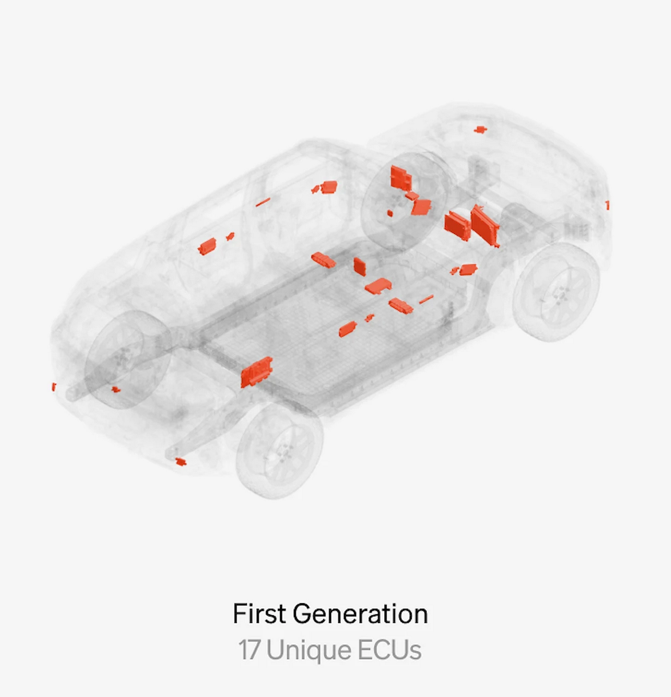
    
    
</div>

<!-- 
There is software **controlling your car, 

your heart, 

and your brain**. And these all have wireless access, and can be hacked.

If firmware isn't reliable, then everything else above us on the software stack is compromised.

https://www.popsci.com/technology/rivian-zonal-electrical-architecture/
https://www.shutterstock.com/image-vector/human-heart-pacemaker-cardio-implant-1367119706
-->
---

<!-- _header: "" -->
<!-- _paginate: hide -->

<h1>Compile time techniques for safer firmware</h1>

## **Samir Rashid**, Evan Johnson, Nico Lehmann, Ranjit Jhala
### Open Source Firmware Conference, September 3, 2024

<br /> <br /> <br /> <br /> <br />

Presentation permalink:
[godsped.com/safe-firmware](https://godsped.com/safe-firmware/)

<!--
My name is Samir Rashid and I am going to describe how the Tock operating system eliminates many bugs that plague other OSes at compile time and how we are mitigating logic bugs in Tock OS using lightweight formal verification.
-->
---

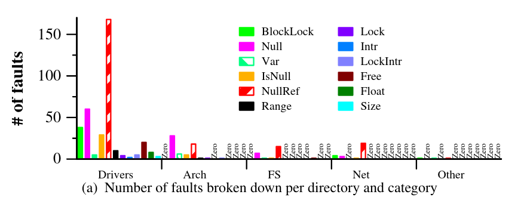
<!--
Before we see how Tock OS is safe, we need to understand our threat model. What kinds of bugs do systems face that we want to protect Tock from?

If you look at the types of bugs in Linux, you will see two things. Most bugs are located in drivers and most to do with memory. Different types of bugs are not equally distributed, so protecting ourselves from some kinds of bugs actually prevents the vast majority of failures.
-->
---

# Classifying bugs

* **Memory management**: buffer overflows, null dereference
* **Undefined behavior** 
<br>
* **Faulty drivers**
* **Concurrency/Locking** <!-- Issues with race conditions or deadlock -->
<br>
* **Logic bugs**: *semantic* errors <!-- programmer has a misunderstanding -->
* **Malicious attacks**: `xz` poisoned contributions <!-- (two tiered trust, no memory bugs,  no external deps) -->

<!--
We have a spectrum of bugs that range in difficulty to fix.
Let's look at how Tock works to mitigate all these threats.

https://tockos.org/documentation/design
-->
---

# 1. Compartmentalizing firmware with Rust

## 2. Lightweight verification for firmware

<!--
First I will give an overview of Tock OS and its design, then I will share our work applying formal verification to Tock.
-->
---

# Tock OS
* embedded operating system
* designed for safe, robust multitenancy on microcontrollers

<!-- Tock is an OS for low-power embedded devices and enforces isolation and safety between processes. Tock is used as a research platform in many universities. Some use cases are as an OS for connected IoT devices or as a root of trust, as it is being used in OpenSK and OpenTitan. Tock runs on millions of consumer devices. -->

<br>

* used at   
* used in industry by Google, Microsoft, HP, Western Digital
*  

<!-- pluton OS and modern chromebook security processor -->

<!-- # We need OSes to be safe

> We show that the lifespan of faults in Linux 2.6 is comparable
> to that observed for previous versions, at slightly under 2 years.
> Nevertheless, we find that fault kinds that are more likely to have
> a visible impact during execution have a much shorter average
lifespan, of as little as one year

> Although fault-finding tools are now being used regularly in
Linux development, they seem to have only had a small impact
on the kinds of faults we consider. Research is thus needed on
how such tools can be better integrated into the development
process.

https://coccinelle.gitlabpages.inria.fr/website/papers/asplos11.pdf

--- -->

<!-- # most bugs come from drivers
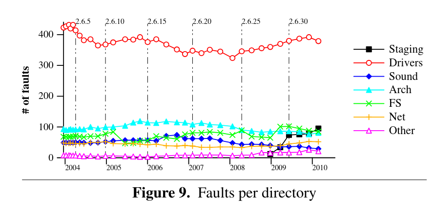

--- -->

<!-- # most bugs are problems with `null` (memory safety) -->

<!-- 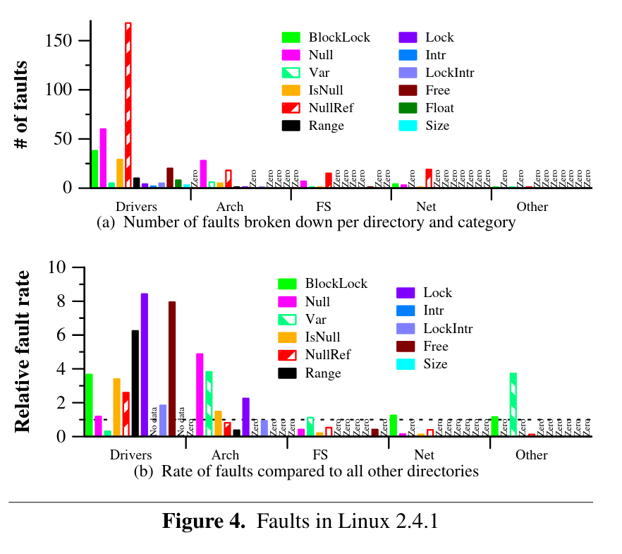 -->

---

# Processes: hardware protection

<div class="twocols">
<br>

* isolated by Memory Protection Unit
* written in any language
* loadable and restartable
<!-- - stack will grow towards MPU boundary, preventing process data corruption. A reall issue on these severely memory constrained devices -->

<p class="break"></p>

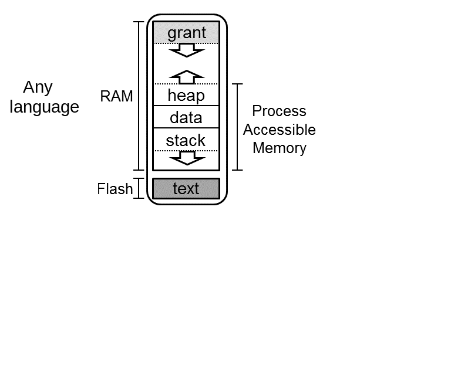

---

# Capsules (drivers) are isolated by Rust

<div class="twocols">
<br>

* written in **safe** Rust
* users choose which capsules to trust <!-- Capsules are also written in Rust and are compiled with the kernel, so you can choose which capsules to trust.  -->
* **zero-size capabilities** enable access to privileged functions <!-- capabilities are enforced through the type system. Basically this means that a capsule that wants to do something privileged such as having control over the network, then it is given a type that says you can use the network at compile time. Then in order to call network functions it provides that type. This means that if a capsule tries to do something illegal, it will fail at compile time. -->
* **zero cost** overhead for this isolation via Rust language safety
  <!-- - move almost all memory and CPU overhead of security checks to compile-time -->
* static memory usage <!-- - gets memory from grant region of each process -->
* **capsule threat model is buggy but not malicious**
<!-- * buggy userspace drivers cannot compromise system *integrity* as they are isolated from the rest of the kernel-->

<!-- TODO: show capability function signature?, gloss over explanation
```rs
pub fn manage_process<C: ProcessManagementCapability>(_c: &C) {}

pub unsafe trait ProcessManagementCapability {}
``` -->

<p class="break"></p>

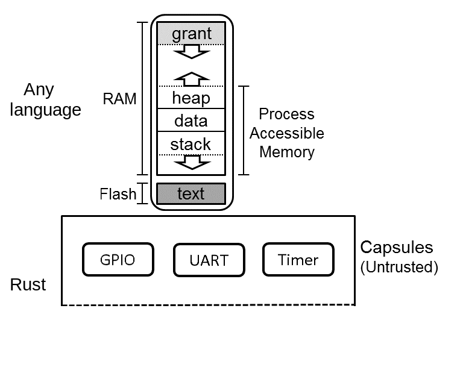

<!-- need some compile time access to kernel but we are isolating them. we dont care that they can be buggy because they are isolated -->
---

# Kernel

<div class="twocols">
<br>

* small Trusted Compute Base
* safety via Rust's language sandbox
<!-- WE DO CARE ABOUT LOGIC BUGS in the kernel
Uses unsafe Rust, but fundamentally abstractions over hardware need to be unsafe and trusted. do need to trust hardware drivers
-->

<p class="break"></p>

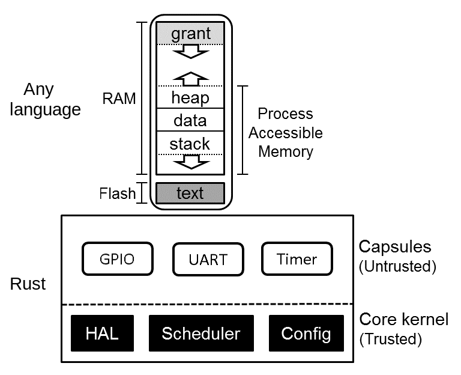
<!-- The kernel is only a few thousand lines, so this pushes complexity to drivers. The kernel is written in Rust and Rust enforces memory safety for the system. -->
---

# Secure by design

<!-- TODO: these are not aligned -->

<!-- Rust is great, we have now eliminated memory and implicit undefined behavior.-->
* **Rust**
  * **Memory management** &nbsp;&nbsp;&nbsp;&nbsp;&nbsp;&nbsp;&nbsp; ✅ Rust language safety
  * **Undefined behavior** &nbsp;&nbsp;&nbsp;&nbsp;&nbsp;&nbsp;&nbsp;&nbsp;&nbsp;&nbsp;&nbsp; ✅ undefined behavior is explicit with `unsafe`
* **Architecture** <!-- Next, Tocks' architecture compartmentalizes the tiers you need to trust drivers, bypasses concurrency problems as it is not concurrent. -->
  * **Faulty drivers** &nbsp;&nbsp;&nbsp;&nbsp;&nbsp;&nbsp;&nbsp;&nbsp;&nbsp;&nbsp;&nbsp;&nbsp;&nbsp;&nbsp;&nbsp;&nbsp;&nbsp;&nbsp;&nbsp;&nbsp;&nbsp; ✅ capsules are isolated
  * **Concurrency/Locking** &nbsp;&nbsp;&nbsp;&nbsp;&nbsp;&nbsp;&nbsp;&nbsp;&nbsp;✅
* **❓❓❓** <!-- using safe Rust and disallowing external dependencies reduces Tock's attack surface, but bugs can always get through even the most scrutinized open source projects and now projects need to deal with the reality that there could be highly resourced attackers who want to exploit their project, such as what happened to xz.
-->
  * **Logic bugs** &nbsp;&nbsp;&nbsp;&nbsp;&nbsp;&nbsp;&nbsp;&nbsp;&nbsp;&nbsp;&nbsp;&nbsp;&nbsp;&nbsp;&nbsp;&nbsp;&nbsp;&nbsp;&nbsp;&nbsp;&nbsp;&nbsp;&nbsp;&nbsp;&nbsp;&nbsp;&nbsp; ⚠ testing and code review is not enough
  * **Malicious attacks** &nbsp;&nbsp;&nbsp;&nbsp;&nbsp;&nbsp;&nbsp;&nbsp;&nbsp;&nbsp;&nbsp;&nbsp;&nbsp;&nbsp;&nbsp;&nbsp; ❌️

<!-- [Threat model](https://github.com/tock/tock/tree/master/doc/threat_model), [Design](https://tockos.org/documentation/design) -->
<!-- TODO: mention *encapsulated functions* 

# Note: concurrency

- Tock is not concurrent so these don't apply
- can use tools like Loom, Shuttle, Miri, mirai to stop undefined behavior and concurrency issues
So we are left with this really tough problem. How do we deal with these last two? 
-->
---

# you can still have A LOT OF bugs

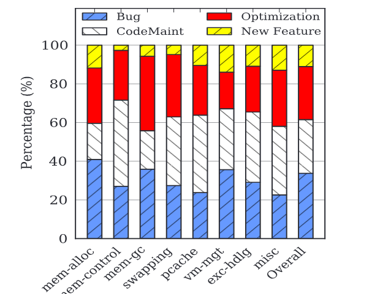

[Huang 2016](https://www.usenix.org/system/files/conference/atc16/atc16_paper-huang.pdf)
<!-- 90% of patches to linux memory allocation code are bugfixes, code maintenance, and optimizations.  10% are new features -->
---

# bugs stay undetected (and exploitable) for years

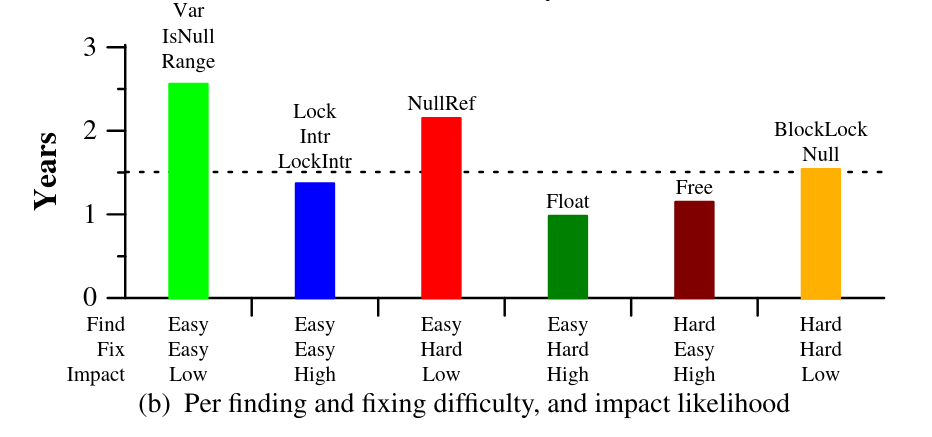

[Palix 2011](https://coccinelle.gitlabpages.inria.fr/website/papers/asplos11.pdf)
<!--
If you look at bugs which have been fixed in the Linux kernel, they last on average about two years from introduction to fix. -->
---

## 1. Compartmentalizing firmware with Rust

# 2. Lightweight verification for firmware

---

# what is formal verification?

<h2>

> Formal verification is the process of using automatic proof procedures to establish that a computer program will do what it’s supposed to.

</h2>

\- [Amazon](https://www.amazon.science/blog/how-to-integrate-formal-proofs-into-software-development)

<!-- We want our programs to be “correct” and have certain properties - not leaking sensitive data, or is crash safe.  -->

---

## **here are all the rumors you have heard**

- "It is so slow"
- "I don't want to rewrite my code"
- "You need a PhD in formal methods first"

---

## **here are all the rumors you have heard**

- "It is so slow" -> **takes seconds**
- "I don't want to rewrite my code" -> **incrementally retrofit existing code**
- "You need a PhD in formal methods first" -> **actually it's easy!**

---

# Demo: `abs()`

<iframe
  id="inlineFrameExample"
  title="Inline Frame Example"
  width="100%"
  height="100%"
  src="https://flux.programming.systems/?code=U1aMTszJyS_XKM0rLU5N0Yzl4krLU0hMKtaosFLINDbSVNC1A9EK1VwKCplpChUKdrYKBmCegkIFkKxVSM0pToUK6IJFuGoB">
</iframe>

<a style="text-align: center; font-size: 1em;" href="https://flux.programming.systems/?code=U1aMTszJyS_XKM0rLU5N0Yzl4krLU0hMKtaosFLINDbSVNC1A9EK1VwKCplpChUKdrYKBmCegkIFkKxVSM0pToUK6IJFuGoB">
https://flux.programming.systems/
</a>

<!--
I am going to be showing a tool called Flux. Flux is under active development and allows you to refine variables in Rust.

So we have this funciton to do absolute value.
Flux is modular, so if we want to express some properties about this function, then it is just like adding a type signature to this function. 
-->
---

# Example of running the type system on a function

<!-- Typing is function wide -->

<!-- TODO: just say precondition, postcondition live. show the failure with no type signature. how can we fix this. then we can also show output is positive. -->

```rs
fn abs(x: i32) -> i32 {
  if x >= 0 {
    x
  } else {
    -x
  }
}
```
<!-- This works because Rust compiles and we have no constraints -->

---

## then we can add this
```rs
#[flux::sig(fn(x: i32) -> {v. i32[v] | v >= 0 && v >= x})]
```
## fails because `abs(MIN_INT)` overflows

```rs
#[flux::sig(fn(x: i32{x != i32::MIN}) -> {v. i32[v] | v >= 0 && v >= x})]
```

<!-- 
Say this during demo

Subset of the parent type
you can express whatever contraints you want
-->
---

# liquid types  
## liquid types = types + *decidable* logical predicates

<!--
Flux is built on liquid types, which is a form of refinement types.

Another interesting use case is you could refine your own datastructures to prevent out of bounds indexing or redundant checks on function inputs.
-->
---

# Demo: refine PMP from RISC-V spec

<!-- ## Claim:: a lot of bugs happen when systems don't behave as the developer expects, or the hardware doesn't behave as the system expects -->

<!-- I got these requirements from the RISC-V spec. So now even without reading the code, just from looking at the types and function headers I know this code does have a correct view of the hardware. We can extend this to express certain invariants. For example, we always want the following property to hold: that a process can always access its own memory and not anyone else's.
This makes it impossible to have the bug like we saw before. -->


## **Goal: encode the spec into the code**

we are still working on the formal model, but this is the high level for how you would apply liquid types to abstract properties

This means you can reduce trust on the kernel and rely on the specification of the flux annotations to maintain memory isolation.

---

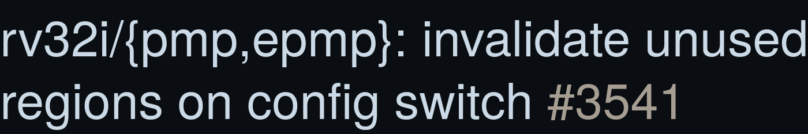

[tock#3541](https://github.com/tock/tock/issues/3541)
<!-- [tock#2135](https://github.com/tock/tock/issues/2135) -->
<!-- We are going to look at how you could prevent a bug like this from ever getting introduced. Do you think it is possible to prevent a logic bug like this at compile time? -->
---

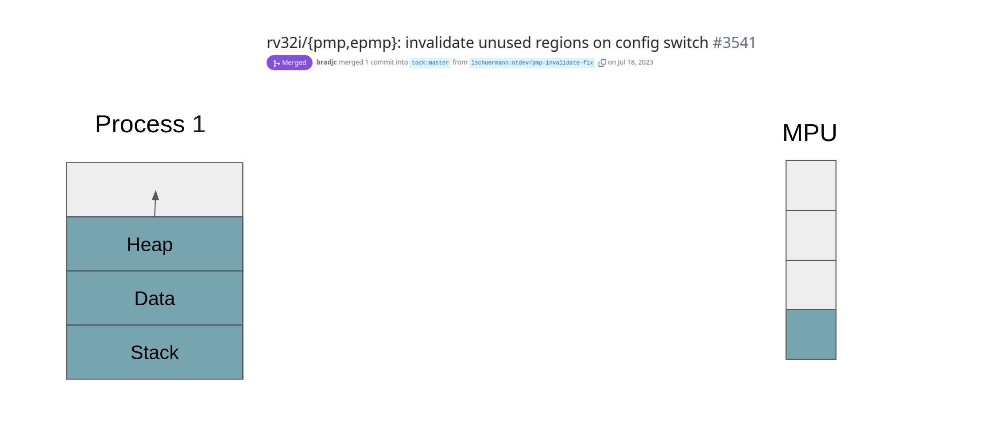

---

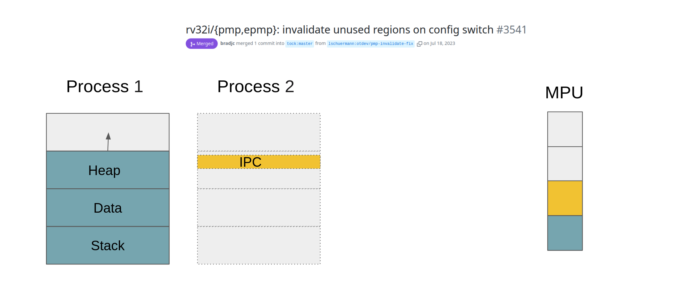

---

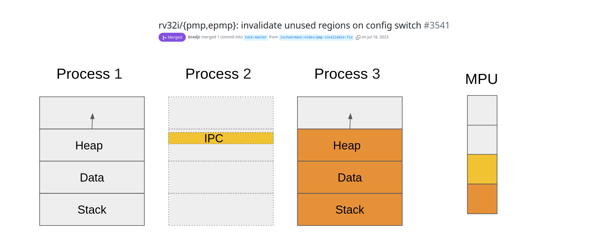


<!-- 
I have copied the headers from Zephyr

```c
static bool set_pmp_entry(unsigned int *index_p, uint8_t perm,
			  uintptr_t start, size_t size,
			  unsigned long *pmp_addr, unsigned long *pmp_cfg,
			  unsigned int index_limit)
```

--- -->

<!-- # at compile time let's try illegal things

Now with flux, our spec is in our code

{before: comments, man page, hundreds of page intel spec} -> rustc.

LIVE DEMO: just add the type signatures to the todo!(); unimplemented functions

Then show the development process that these things will fail at compile time. -->

<!-- ---
# Demo: `can_access` predicate
Now these failures are great. But Flux gives us even more superpowers.

- add the can_access predicate and find a bug (tock uncleared region bug). -->

<!-- How many of you can look at a MPU function in your code and know it cannot get called to accidentally expose kernel data to processes? It is probably not so easy! You either read through your code and will see some runtime code in the function which asserts this or you have no idea. You are waiting for an attacker to figure it out for you.
Here seeing what your code guarantees is simply the act of reading the function signature and any annotated invariants. -->


<!-- # Let's take a look at a real piece of code from Zephyr's MPU configuration and translate this to Tock+Flux

```c
/* Region definition data structure */
struct arm_mpu_region {
	/* Region Base Address */
	uint32_t base;
	/* Region Name */
	const char *name;
#if defined(CONFIG_CPU_AARCH32_CORTEX_R)
	/* Region Size */
	uint32_t size;
#endif
	/* Region Attributes */
	arm_mpu_region_attr_t attr;
};

/* MPU configuration data structure */
struct arm_mpu_config {
	/* Number of regions */
	uint32_t num_regions;
	/* Regions */
	const struct arm_mpu_region *mpu_regions;
};
```

[zephyr/include/zephyr/arch/arm/mpu/arm_mpu.h](https://github.com/zephyrproject-rtos/zephyr/blob/6b8ebeb9d19a5c267c204e55fea889f955101362/include/zephyr/arch/arm/mpu/arm_mpu.h#L28)

--- -->

<!-- # Now I am going to explain how this is working.

- these are all subtypes, so they are still valid types
- subtype encodes properties
- can use SMT

```c
x = 0 // int[0]
y = 1 // int[1]
x + y // int[1] done by typing rules
// but you can do this for arbitrary predicates
```

```
another example fully annotated
```

--- -->

<!-- ---

# You can catch index out of bounds

```rs
RVec

fn refine_length of array
```

This *could* enable you to refactor your code to be faster since you won't need to use Rust runtime bounds checking as you know the length of your data statically.

[bounds checking](https://readyset.io/blog/bounds-checks)
[liquid haskell presentation](https://github.com/Gabriella439/slides/blob/main/liquidhaskell/slides.md) -->

<!-- Now you can safely index without using iterators. This could help performance by avoiding bounds checking on hot paths. -->

<!-- A refinement type denotes a subtype of another type, characterized by a given predicate. In our example, { i:Int | 0 <= i && i < len xs } is a subtype of Int, whose values i satisfy the predicate 0 <= i && i < len xs. The specifications allow us to name the arguments of functions and to refer to them in the predicates, such as the list argument named xs. The language used to describe a predicate is not Haskell, but a separate language with functions and logical connectives. When predicates need to refer to Haskell functions, the functions can be translated to the logic.

The function elemAt continues to be partial in Haskell, but it is total according to its specification. And Liquid Haskell is powerful enough to check that elemAt meets the specification, i.e. given a valid index, the function won’t fail. It is a choice of the user to use Liquid Haskell to ensure that the invocations meet the specification as well, or to leave the invocations unverified. The solution not only leaves the original function untouched, which dependent types could also achieve, but it is remarkably economical in the way of expressing the property we care about. -->


<!-- 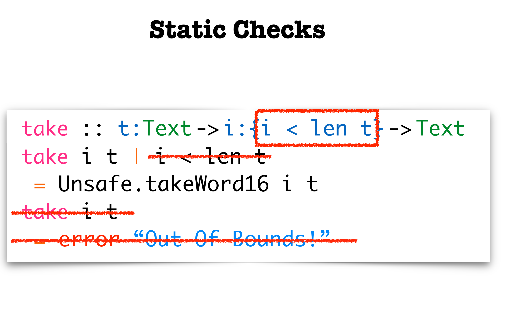 -->

<!-- ---

# examples of bugs caught

often the worst bugs are hard to reproduce or imagine (you have to imagine it to test it)

you can only prove the existence of bugs with testing, not their absence

Do you have any good examples. I have some mediocre ones.

TODO: can i reproduce the timer bug here

   <style>
    .timeline-container {
        position: relative;
        width: 100%;
        height: 50px;
        background-color: #ddd;
        border-radius: 25px;
        overflow: hidden;
    }

    .arrow {
        position: absolute;
        width: 30px;
        height: 30px;
        background-color: #ff5722;
        clip-path: polygon(50% 0%, 0% 100%, 100% 100%);
        animation: moveArrow 5s linear infinite;
        transform: rotate(0deg);
        bottom: 0; /* Position arrow at the bottom */
    }

    .now-dot {
        position: absolute;
        right: 80px;
        top: 50%;
        transform: translateY(-50%);
        width: 20px;
        height: 20px;
        background-color: #4caf50;
        border-radius: 50%;
    }

    .time-display {
        position: relative;
        top: 20px;
        font-size: 20px;
        color: #333;
        text-align: center;
        width: 100%;
    }

    @keyframes moveArrow {
        0% { left: -30px; }
        100% { left: calc(100% + 30px); }
    }
</style>
</head>
<body>

<div class="timeline-container">
    <div class="arrow" id="arrow"></div>
    <div class="now-dot"></div>
</div>
<div class="time-display" id="timeDisplay">The time to do this is 0</div>

<script>
    const arrow = document.getElementById('arrow');
    const timeDisplay = document.getElementById('timeDisplay');
    const timelineWidth = document.querySelector('.timeline-container').offsetWidth;
    const nowDotPosition = timelineWidth - 40; // Position of the "now" dot

    function updateTime() {
        const arrowPosition = arrow.getBoundingClientRect().left;
        const distanceToNow = Math.abs(arrowPosition - nowDotPosition);

        if (arrowPosition < nowDotPosition - 300) {
            timeDisplay.textContent = 'soon';
/*         } else if (arrowPosition >= nowDotPosition || arrowPosition > nowDotPosition - 300) {
            timeDisplay.textContent = 'now'; */
        } else {
            timeDisplay.textContent = `The time to do this is in ${Math.round(arrowPosition - timelineWidth + nowDotPosition)} days`;
        }
    }

    setInterval(updateTime, 100); // Update the time display every 100ms
</script> 

-->


<!--
I don’t have great examples but I can show you there have been timer things caught in Tock via loose formal methods and the AWS example of hash collision.

Developers have more confidence in implementing optimizations and accepting code changes in PRs.
I have found bugs that are virtually impossible to find by reading the code. We will take a look at previous security bugs in Tock, how we came up with system properties to verify, and show how these problems are now impossible produce.
-->

---

# Summary

<!-- Tock eliminates -->

* **Rust**
  * **Memory management** Rust language safety
  * **Undefined behavior** is explicit and minimized
* **Architecture**
  * **Faulty drivers** capsules are isolated from kernel
  * **Concurrency/Locking** avoided
* **Lightweight verification** 
  * **Logic bugs** via verification
  * **Malicious attacks** cannot break the easily auditable compile-time safety

---

## Tock: safe embedded operating system
Tock is open source!
https://tockos.org/
Join Tock Slack, Matrix, verification mailing list


## Flux: scalable Rust verification
> Proving should be as easy as programming 

https://github.com/flux-rs/flux/

https://flux.programming.systems/

## Presentation permalink: [godsped.com/safe-firmware](https://godsped.com/safe-firmware/)

---

# Errata slide


<!-- 
hi > lo, doesnt overflow address

- kernel/app break overlap. show arbitrary high level property and then verify that

you donn't find bugs weeks later with fuzzing or months later with integration testing.

TODO: learn the syntactic sugar, what is @
TODO: read flux docs
TODO: find WaVe src code
TODO: NEED TO UNDERSTAND THAT KAPPA LOOP INVARIANT
TODO: need to make sure flux highlighting squiglies works for live demo
TODO: keep backup pdf, printout of extra section titles, tabs open with all demos -->

<!-- 

Here is a real bug Amazon found using methods similar to what we are doing

[using-lightweight-formal-methods-to-validate-a-key-value](https://assets.amazon.science/07/6c/81bfc2c243249a8b8b65cc2135e4/using-lightweight-formal-methods-to-validate-a-key-value-storage-node-in-amazon-s3.pdf)

something about using https://github.com/proptest-rs/proptest with models

https://github.com/GaloisInc/crucible
https://github.com/model-checking/kani


Even experts of the program they wrote can have a hard time debugging things. These bugs can be very costly.
https://corp.roblox.com/newsroom/2022/01/roblox-return-to-service-10-28-10-31-2021

Astrée: "In 2003, Astrée proved the absence of any runtime errors in the primary flight-control software of an Airbus model. The system’s 132,000 lines of C code were analyzed completely automatically in only 80 minutes on a 2.8GHz 32-bit PC using 300MB of memory (and in only 50 minutes on an AMD Athlon 64 using 580MB of memory). Since then, Airbus France has been using Astrée in the development of safety-critical software for vari­ous plane series, including the A380.",

> Despite 20+ years of research on processor verification, it
remains hard to use formal verification techniques in commercial pro-
cessor development. There are two significant factors: scaling issues and
return on investment. The scaling issues include the size of modern pro-
cessor specifications, the size/complexity of processor designs, the size
of design/verification teams and the (non)availability of enough formal
verification experts. The return on investment issues include the need to
start catching bugs early in development, the need to continue catching
bugs throughout development, and the need to be able to reuse verifica-
tion IP, tools and techniques across a wide range of design styles.
https://alastairreid.github.io/papers/cav2016_isa_formal.pdf

Tock is an open source project where we do not have control over what gets accepted. THus we have chosen this approach to gradually make PRs and show the value of merging this work. 

Intel totally does not understand how their CPUs work https://danluu.com/cpu-bugs/

Great Brad presentation on Tock internals: https://docs.google.com/presentation/d/1A7ug4snhK0XUDg7Cc1wWGqCrhlA02pBM/edit#slide=id.p1

Toyota unintended acceleration
https://www.nhtsa.gov/sites/nhtsa.gov/files/nasa-ua_report.pdf
https://www.nhtsa.gov/sites/nhtsa.gov/files/nhtsa_report_execsum.pdf
https://en.wikipedia.org/wiki/2009%E2%80%932011_Toyota_vehicle_recalls#Investigations
https://users.ece.cmu.edu/~koopman/pubs/koopman14_toyota_ua_slides.pdf AMAZING SLIDES
-->

---

# backup slides

---

# Walkthrough

<!-- Let's try finding the type of abs() -->
```rs
fn abs(x: i32) -> i32 {
    if x < 0 {
      0 - x
    } else {
        x
    }
}
```
```rs
x : i32
0 : i32{v: v == 0}
x < 0 :: bool{b: b == x < 0 }
0 - x :: i32{n: n == 0 - x }

if x < 0 then 0 - x else x
    :: i32{n:
       |    (      x < 0  => n == 0 - x )
         && ( not (x < 0) => n == x     )
       }
```

---

The inferred type is stronger than the postcondition we originally requested:
```rs
if x < 0 then 0 - x else x
    :: i32{n : 0 <= n }
```

---

# SMT solver

Flux uses a Satisfiability Modulo Theories to check typing rules

Flux will ask an SMT solver (Z3) if the return type is a subtype of the function return type.

```rs
if x < 0 then 0 - x else x
    :: i32{n:
       |    (      x < 0  => n == 0 - x )
         && ( not (x < 0) => n == x     )
       }
```

... is a subtype of the user-supplied type:

```rs
if x < 0 then 0 - x else x
    :: i32{n : 0 <= n }
```

[src](https://github.com/Gabriella439/slides/blob/main/liquidhaskell/slides.md)
<!-- TODO: check my syntax here -->

---

# Key point

Able to reason about complex thingss in an imperative language due to Rust ownership

```rs
fn ris() {
  let mut x = vec![0, 1];  // x: Vec<i32>
  let y = x;               // x: Uninit, y: Vec<i32>
  x = vec![2, 3]           // x: Vec<i32>, y: Vec<i32>
}

fn hefe() {
    let mut x = 0;      // x: i32[0]
    x += 10;            // x: i32[10]
    x += 10;            // x: i32[20]
}

```

---

At any given time, you can have either one mutable reference or any number of shared references.

```rs
fn decr(x: &mut {v. i32[v] | v > 0}) {
   *x -= 1;
}

```
Writing through an &mut reference must preserve refinements

Can fix by
```rs
fn decr(x: &mut {v. i32[v] | v > 0}) {
   let n = *x;
   if n > 1 {
      *x = n - 1;
   }
}

```

Does get a bit more complicated with mutable changes where the type changes.

---

# Java binary search slide

---

# What is an SMT solver

---


# Recap

1. Completely untrusted (by kernel, each other): Applications
2. Trusted for liveness, software enforcement of memory
safety: Kernel capsules (networking stack, console, sensor
drivers, virtualization layers), chip specific code
3. Completely trusted: Core kernel (board/architecture spe-
cific code, scheduler, configuration)

[Tiered Trust](https://people.eecs.berkeley.edu/~prabal/pubs/papers/ayers22tiered.pdf)

---

# Grammar of refinements

```rs
r ::= n                     // numbers 1,2,3...
    | x                     // identifiers x,y,z...
    | x.f                   // index-field access
    | r + r                 // addition
    | r - r                 // subtraction
    | n * e                 // multiplication by constant
    | if r { r } else { r } // if-then-else
    | f(r...)               // function application
    | true | false          // booleans
    | r == r                // equality
    | r != r                // not equal
    | r < r                 // less than
    | r <= r                // less than or equal
    | r > r                 // greater than
    | r >= r                // greater than or equal
    | r || r                // disjunction
    | r && r                // conjunction
    | r => r                // implication
    | !r                    // negation
```

---

# Tock Architecture
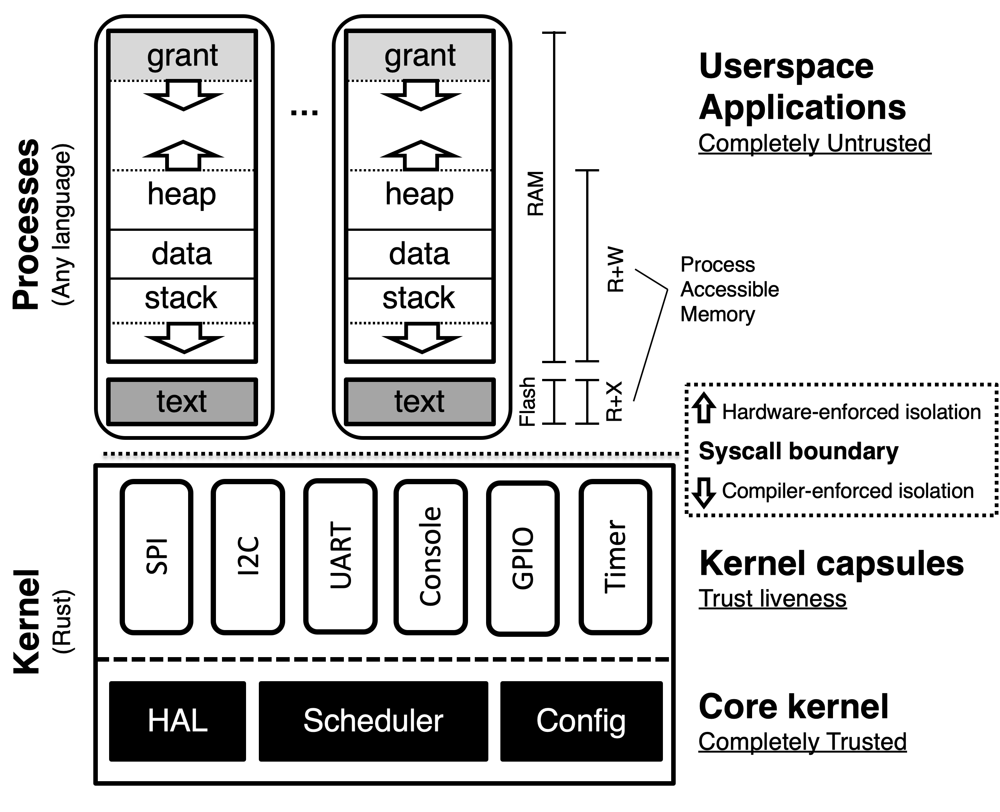

---

# Tock Architecture

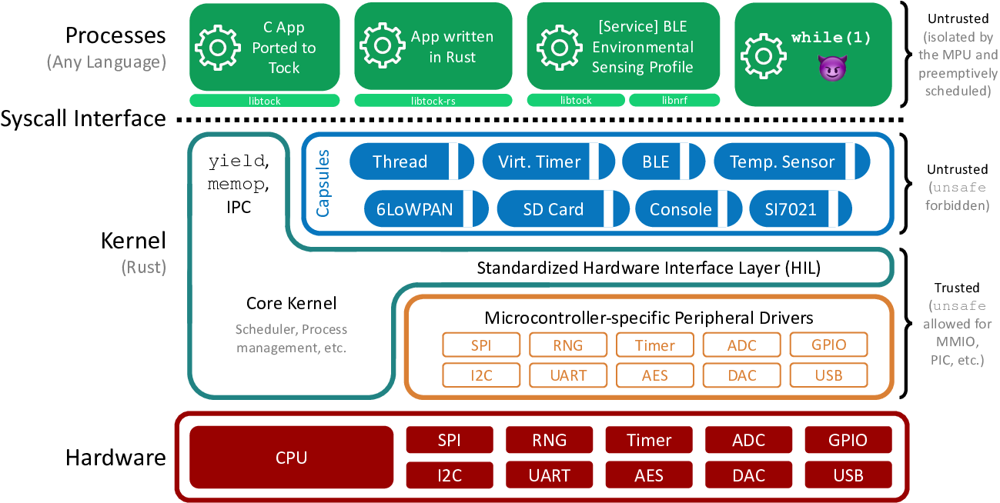

---

# Flux LOC overhead

---

# Flux typing runtime overhead (seconds)

---

# Rvec

---

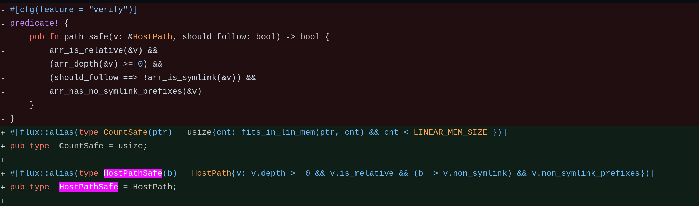

---
# random claims

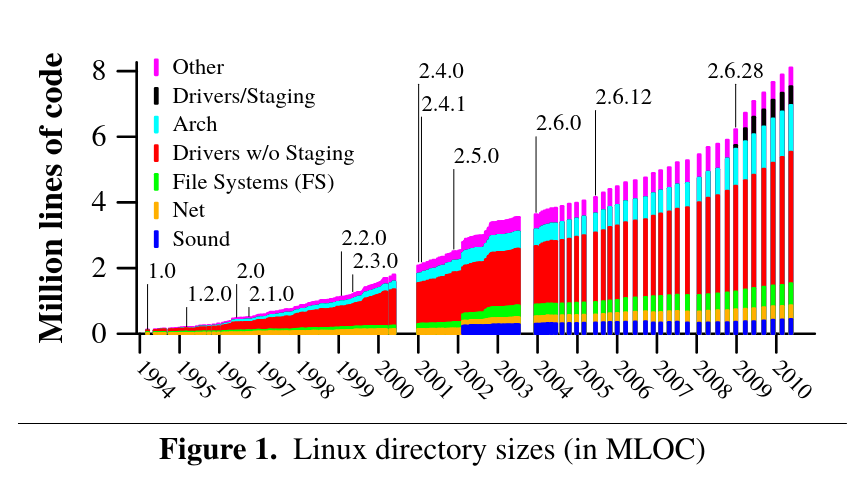
Linux is huge and growing
[Palix 2011](https://coccinelle.gitlabpages.inria.fr/website/papers/asplos11.pdf)

<!-- There are still ways to unexplicitlt panic https://stackoverflow.com/a/72705968 -->
<!-- ---

# Logic bugs are the hardest to find. (thus we need verification)

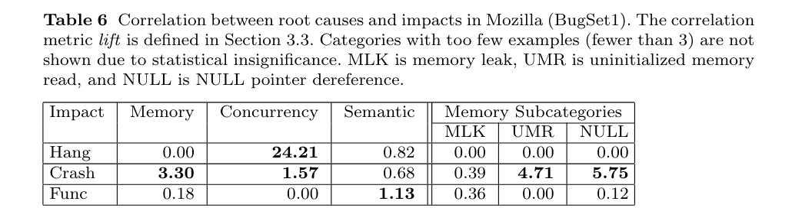

https://www.cs.purdue.edu/homes/lintan/publications/bugchar-emse14.pdf

Logic bugs don't manifest as crashes, so it is not enough to do fully automated methods such as fuzzing. Fuzzing for properties will not capture every execution, so it is better to catch bugs earlier and faster with verification.  Fuzzing wont find bugs during development.

* Rust does do runtime bounds checking for other kinds of indexing.
Thankfully safe Rust doesn't have undefined behavior, apart from compiler bugs. The catch? It's that the defined behavior is to panic and crash.
-->

<!-- # Kinds of logic bugs
- Indexing*
- Integer overflows
- Divide by zero
- Application specific misbehaviors -->

<!-- https://www.cs.purdue.edu/homes/lintan/publications/bugchar-emse14.pdf -->

---

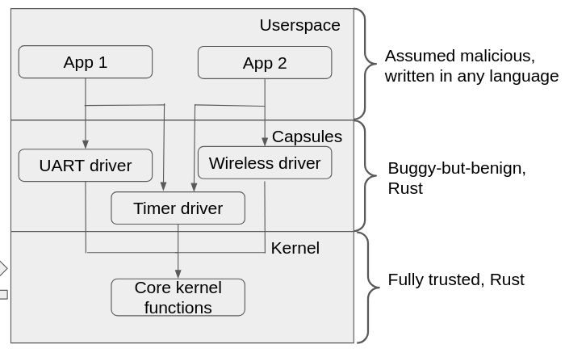

---


# example of a more complex property
**Security of a sandbox - read wave**
security of IFC - read other paper
Show LOC stats
high level idea of memory protection in tock

<!-- https://github.com/flux-rs/flux-demo/blob/main/src/typestate.rs -->

---

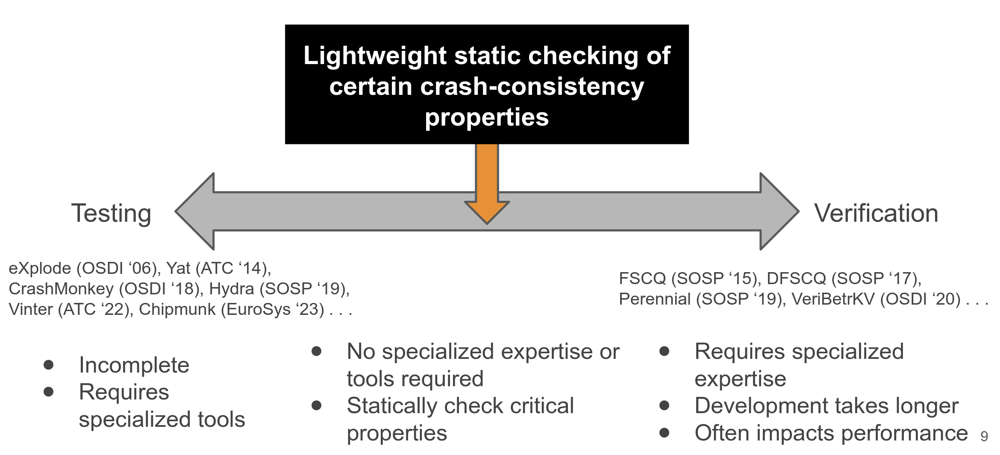
squirrelfs

---

Typestate guard against power leaks

RAII where the objects are hardware

---

# Downsides
<!-- Flux and real world verification is still quite nascent, but the underlying theoretical foundations are decades old. And this robustness definitely shows. Our work using Flux is actively guiding its development as we work to make Flux production ready for anyone to use. -->

* More mental effort
  * but now you understand your code...
* Active development
  * currently, not stable!!!
* Not as powerful as other formal methods
<!-- I think the future is combining different kinds of formal techniques. (like AWS shardstore) -->

<!-- # Things are looking up -->
<!-- TODO: let's retrospect for a second, read backwards. -->
<!-- you donn't find bugs weeks later with fuzzing or months later with integration testing. -->

<!-- 
among subsystems
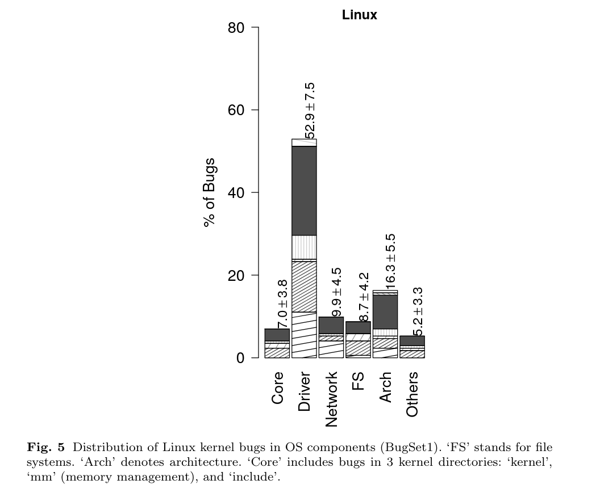

https://www.cs.purdue.edu/homes/lintan/publications/bugchar-emse14.pdf
--- -->

<!-- 
# Claim: bugs are not uniformly distributed

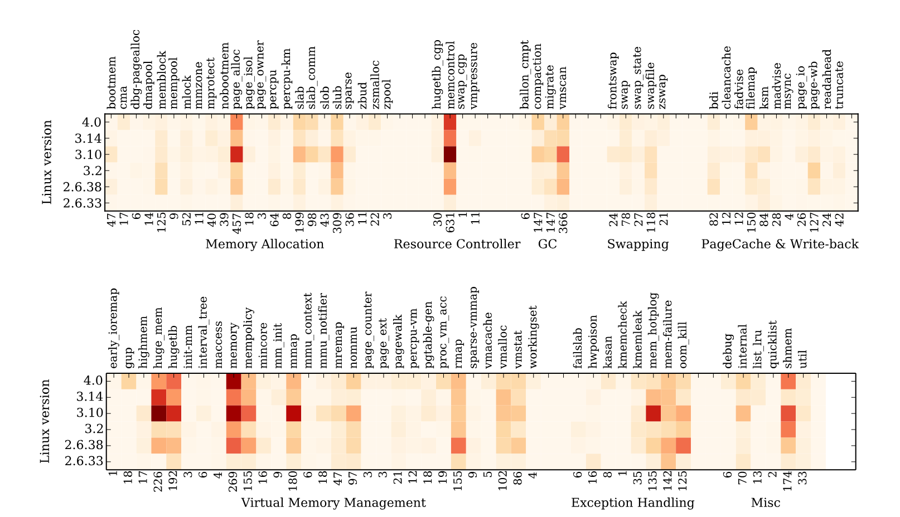

or among files. ie. we know where the complexity lies and could capture and prove those areas to be bug free -->

<!-- 
TODO: mention these two facts, very interesting


> Summary: Linux mm is being actively updated,
The code changes are highly concentrated around its
key functionalities: 80% of the patches were com-
mitted to the 25% of the source code.

<br>

> 4.2 Semantic Bugs Are Dominant Root Causes.
Figure 1(a) shows that the dominant root causes are semantic bugs in Mozilla,
Apache, and the Linux kernel, accounting for 87.0% in Mozilla, 82.5% in
Apache, and 70.1% in the Linux kernel.  

We should be putting the most effort towards stopping the worst kinds of bugs (data loss, isolation breaks)
-->


<!-- > Memory Error (MErr): We find that null pointer
dereferences (e.g., [45, 67, 76]) are the most common
bugs because of the missing validations of pointers be-
fore using them in mm

--- -->

<!-- > Logic: We identify three important logic bugs: case-
by-case, state update and fault handler. For the first
two types, they may not stall the system or generate ex-
ceptions immediately, but they make the system execute
in unexpected workflow or states, resulting in incorrect
states or runtime error eventually. Fixing these bugs of-
ten require domain specific knowledge. For example,
when shmem intends to replace a swap cache page, the
original implementation calls cgroup migration without
lrucare based on the incorrect assumption that the page
is not on the LRU list

https://www.usenix.org/system/files/conference/atc16/atc16_paper-huang.pdf

--- -->

<!-- They find that even mature memory alocators are bugging due to their complexity.
We could verify specific properties
Security bugs are increasing

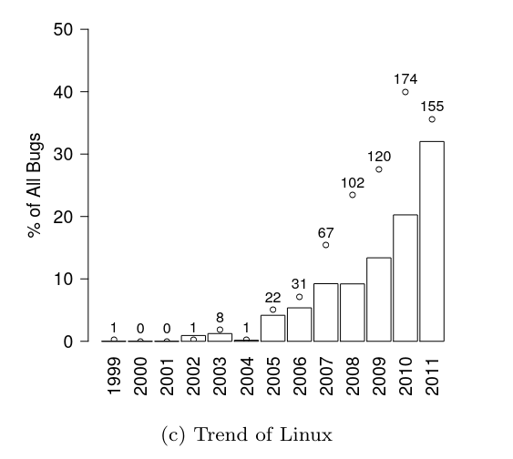 -->

<!--
we have had such a probelm with solving all corner cases in timers in tock. *insert joke*. It's time to squash these bugs. Oh wait the time is in four billion seconds.  -->

<!-- 
# gradual types for verification idea.

- like optional typing in Python -->
<!-- What if we could optionally annotate with logical constraints in the same way you use any type system
So easy to prevent divide by zero bugs at compile time
YOU GET FEEDBACK ON BUGS WHILE YOU DEVELOP! NOT AFTER like in model checking or less formal processes like automobile certification -->

<!-- - gradual and noninvasive
- does not require you to be an expert to verify. -->

<!-- What does this look like -->

<!-- 
do the cool inverted blue box focus around this (logic errors)

The problem is not the number of bugs, but its severity.
-->

<!-- For this section, I'm going to go over formal verification. We are going to take a look at the most serious bug ever in Tock's memory isolation and learn how to provably prevent it from ever happening again. 
We are going to build up some intuition for how to prevent this from happening.
-->

<!-- ---

# Idea

You Index types with pure values
```js
         B[v]
Base-Type    Refinement Index
```

Meaning of the index depends on the type

<br>

i32 is indexed by the (pure) integer it is equal to
```rs {1}
let x = 5;     : i32[5]
let y = 2 + 3; : i32[5]
```

```rs {2-3}
true   : bool[true]
3 < 10 : bool[true]
``` -->

<!-- ---

# liquid types
Subset of the parent type

* Type:
```rs
i32{v: 0 < v} // positive `i32`s
```

* Function:
```rs
#[flux::sig(fn(a: i32, b: i32) -> i32{v: v >= a && v >= b})]
pub fn max(a: i32, b i32) -> i32
Precondition             Postcondition
``` -->

<!-- 
---

# Example runtime bug: index out of bounds

```rs
fn print_first(vec: Vec<i32>) {
   println!("first: {}", vec[0]);   . 
}

fn main() {
   print_first(vec![]);
}
```

TODO: verify this to not crash by showing adding ghost var to verify vector length

```md
thread 'main' panicked at 'index out of bounds: the len is 0 but the index is 0'
``` -->

<!-- It turns out that we can prevents bugs like this at compile time, meaning there is no runtime cost associated with bounds checking. -->


<!-- ---

# Note: Tock uses Typestate and a lot of Rust-isms that detract from the main idea, so we will look at Zephyr.
# Typestate, but with Flux

If you have used typestate in Rust or RAII, this is similar. You can push complexity into compile time, making it easier to write correct code. 

> Typestates are a technique for moving properties of state (the dynamic information a program is processing) into the type level (the static world that the compiler can check ahead-of-time).

https://cliffle.com/blog/rust-typestate/ -->

<!--
This enables things like the zero cost capabilities I mentioned earlier.
This is pretty cool! Now we can avoid some pretty subtle bugs at compile time.

Okay this is relatively straightforward. Now we have seen why this is low cost verification and how well it integrates into the type system.
Let me explain how this works and we can look at a more complex scenario.

If you don't want to rearchitect your app to use typestate, you can use Flux.
Maybe one day we will have automated C->Rust code conversion. For whatever reason you could use this instead of typestate.
-->

<!-- Also, because these states are enforced by the type system, there is no longer room for errors by consumers of this interface. If they try to perform an illegal state transition, the code will not compile! -->

<!-- Hardware security is great, but it is useless if we don't configure it correctly. very small bug can be a very big problem. -->

<!-- ---

# RVec

```rs
#[flux::opaque]
#[flux::refined_by(len: int)]
#[flux::invariant(0 <= len)]
pub struct RVec<T> {
    inner: Vec<T>,
}
``` -->

<!-- 
---

# What does zephyr RISCV PMP code look like

It performs "sanity checks" = runtime cost.
This simple function can panic if you call it wrong! Can kill the whole system. -->

<!-- TODO: red highlight removed lines-->
<!-- ```c {6-13}
static void write_pmp_entries(unsigned int start, unsigned int end,
			      bool clear_trailing_entries,
			      unsigned long *pmp_addr, unsigned long *pmp_cfg,
			      unsigned int index_limit)
{
	__ASSERT(start < end && end <= index_limit &&
		 index_limit <= CONFIG_PMP_SLOTS,
		 "bad PMP range (start=%u end=%u)", start, end);

	/* Be extra paranoid in case assertions are disabled */
	if (start >= end || end > index_limit) {
		k_panic();
	}
```

Show crossing out these lines. This *could* enable you to refactor your code to be faster since you won't need to use Rust runtime bounds checking as you know the length of your data statically. -->

<!-- Remember that we don't have virtual memory, we only have an MPU to support the OS in protection. -->
<!-- ---

# `write_pmp_entries` (bad pmp range) -> 💣

--- -->

<!-- Now we have a basic understanding of the syntax. Let's turn back to the problem at hand. -->
<!-- # You think your code doesn't have bugs because you write great `requirement`s like this

```c {8}
/**
 * @brief Write a range of PMP entries to corresponding PMP registers
 *
 * PMP registers are accessed with the csr instruction which only takes an
 * immediate value as the actual register. This is performed more efficiently
 * in assembly code (pmp.S) than what is possible with C code.
 *
 * Requirement: start < end && end <= CONFIG_PMP_SLOTS
 *
 * @param start Start of the PMP range to be written
 * @param end End (exclusive) of the PMP range to be written
 * @param clear_trailing_entries True if trailing entries must be turned off
 * @param pmp_addr Array of pmpaddr values (starting at entry 0).
 * @param pmp_cfg Array of pmpcfg values (starting at entry 0).
 */
extern void z_riscv_write_pmp_entries(unsigned int start, unsigned int end,
				      bool clear_trailing_entries,
				      const unsigned long *pmp_addr,
				      const unsigned long *pmp_cfg);
```

https://github.com/zephyrproject-rtos/zephyr/blob/main/arch/riscv/core/pmp.c -->

<!-- Right now the state of the art is comments like this, reading the man page, or doing guess and check if your code works. -->

<!-- # Logic bugs

One problem is if our function is called wrong.

But we can also have logic soundness issues like the Tock bug.

So we do want more guarantees like that you can only access your regions. This was a really subtle and serious bug.

It is simply understood, but very hard to imagine this bug existing.

--- -->

<!-- # Let's improve this with Flux

Note: Tock uses typestate, so you can't have a badly constructed MPU region.

But I am not here to talk about Rust. Now taht we have an idea of how this issupposed to work, let's replicate it in Flux.

--- -->